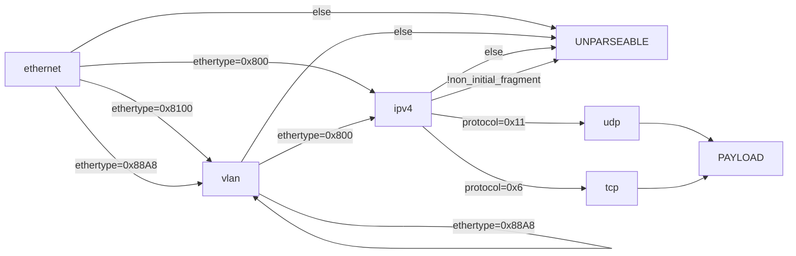

<!-- GENERATED by gen_docs.ml from lib/protocol_spec.ml. DO NOT EDIT. -->
# Parsed protocol stack

## Derived bounds

These are computed from the spec, not chosen by hand. The generated RTL pipeline depth, the golden model, the stimulus generator and the coverage bins all consume the same values, so they cannot disagree.

| quantity | value | consumed by |
|---|---|---|
| worst-case parse window | 46 B (budget 48 B) | cut-through threshold |
| cut-through delay | 6 beats @ 64-bit | egress commit point |
| flow key width | 104 bits | URAM table geometry |
| unparseable action | drop | drop counters |

The parse window is **asserted** in the spec and checked by `validate`. Widening the stack past the budget fails the build rather than silently costing latency.

## Layer graph

## Layers

### `ethernet`

span fixed 14 B &middot; max repeats 1

read depth for classification: **14 B**

| field | bit offset | width | accepted values | role |
|---|---|---|---|---|
| `dst_mac` | 0 | 48 | any | &mdash; |
| `src_mac` | 48 | 48 | any | &mdash; |
| `ethertype` | 96 | 16 | _derived_ | selector |

### `vlan`

span fixed 4 B &middot; max repeats 2

read depth for classification: **4 B**

| field | bit offset | width | accepted values | role |
|---|---|---|---|---|
| `pcp` | 0 | 3 | any | &mdash; |
| `dei` | 3 | 1 | any | &mdash; |
| `vid` | 4 | 12 | any | &mdash; |
| `ethertype` | 16 | 16 | _derived_ | selector |

### `ipv4`

span `ihl` x 4 B &middot; max repeats 1 &middot; exports `src_ip`, `dst_ip`, `protocol`

read depth for classification: **20 B**

| field | bit offset | width | accepted values | role |
|---|---|---|---|---|
| `version` | 0 | 4 | {4} | &mdash; |
| `ihl` | 4 | 4 | {5} | length |
| `dscp` | 8 | 6 | any | &mdash; |
| `ecn` | 14 | 2 | any | &mdash; |
| `total_len` | 16 | 16 | _derived_ | &mdash; |
| `id` | 32 | 16 | any | &mdash; |
| `flags` | 48 | 3 | any | &mdash; |
| `frag_offset` | 51 | 13 | any | guard |
| `ttl` | 64 | 8 | any | &mdash; |
| `protocol` | 72 | 8 | _derived_ | selector, key |
| `checksum` | 80 | 16 | _derived_ | &mdash; |
| `src_ip` | 96 | 32 | any | key |
| `dst_ip` | 128 | 32 | any | key |

**Guards.** The next layer exists only if all hold; otherwise the frame is unparseable and a per-reason counter increments.

- `frag_offset` &isin; {0} &mdash; else `non_initial_fragment` (read depth 8 B)

### `udp`

span fixed 8 B &middot; max repeats 1 &middot; exports `src_port`, `dst_port`

read depth for classification: **4 B**

| field | bit offset | width | accepted values | role |
|---|---|---|---|---|
| `src_port` | 0 | 16 | any | key |
| `dst_port` | 16 | 16 | any | key |
| `length` | 32 | 16 | _derived_ | &mdash; |
| `checksum` | 48 | 16 | _derived_ | &mdash; |

### `tcp`

span `data_offset` x 4 B &middot; max repeats 1 &middot; exports `src_port`, `dst_port`

read depth for classification: **4 B**

| field | bit offset | width | accepted values | role |
|---|---|---|---|---|
| `src_port` | 0 | 16 | any | key |
| `dst_port` | 16 | 16 | any | key |
| `seq` | 32 | 32 | any | &mdash; |
| `ack` | 64 | 32 | any | &mdash; |
| `data_offset` | 96 | 4 | 5..15 | length |
| `reserved` | 100 | 4 | any | &mdash; |
| `flags` | 104 | 8 | any | &mdash; |
| `window` | 112 | 16 | any | &mdash; |
| `checksum` | 128 | 16 | _derived_ | &mdash; |
| `urgent` | 144 | 16 | any | &mdash; |

## Coverage bins

Derived by enumerating selector cases, guard outcomes and repeat depths.

- `ethernet.ethertype == 0x800` -> `ipv4`
- `ethernet.ethertype == 0x8100` -> `vlan`
- `ethernet.ethertype == 0x88A8` -> `vlan`
- `ethernet.ethertype` unmatched -> unparseable
- `vlan.ethertype == 0x800` -> `ipv4`
- `vlan.ethertype == 0x8100` -> `vlan`
- `vlan.ethertype == 0x88A8` -> `vlan`
- `vlan.ethertype` unmatched -> unparseable
- `vlan` at depth 1
- `vlan` at depth 2
- `ipv4.protocol == 0x6` -> `tcp`
- `ipv4.protocol == 0x11` -> `udp`
- `ipv4.protocol` unmatched -> unparseable
- `non_initial_fragment` pass / fail

**15 bins total.**
